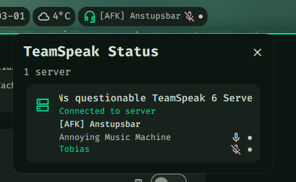

# dms-plugin-teamspeak



DMS bar widget for real-time TeamSpeak status display.

Shows server name, channel, mute state, talking indicator, and away status in your DankMaterialShell bar. The popout panel lists all connected servers with channel members.

### Key Features

- Server name and connection status
- Current channel name with auto-scrolling
- Microphone/speaker mute icons with priority logic
- Talking indicator dot
- Away status icon
- Multi-server badge when connected to multiple servers
- Channel member list in popout with per-user mute/talking/away indicators
- Configurable update rate throttle

## Dependencies

Requires the [ts-status](https://github.com/thisilike/ts-status) binary to bridge the TeamSpeak Remote Apps WebSocket API.

```
go install github.com/thisilike/ts-status@latest
```

## Install

```
git clone https://github.com/thisilike/dms-plugin-teamspeak.git \
    ~/.config/DankMaterialShell/plugins/TeamspeakStatus
```

## Setup

1. In TeamSpeak, go to **Settings > Remote Apps** and enable the Remote Apps API
2. Open DMS Settings
3. Go to Plugins
4. Click Scan
5. Enable "TeamSpeak Status"
6. On first launch, TeamSpeak will show an approval prompt for ts-status — accept it

## Settings

| Setting | Default | Description |
|---|---|---|
| Binary Path | `ts-status` | Path to the ts-status binary |
| WebSocket Address | `ws://localhost:5899` | TeamSpeak Remote Apps WebSocket address |
| Max Update Rate | 30 fps | Maximum UI updates per second |
| Show Server Name | on | Display server name in bar pill |
| Show Channel Name | on | Display channel name in bar pill |
| Show Mute Icons | on | Display mute status icons |
| Show Talking Indicator | on | Display talking dot |
| Show Nickname | off | Display your nickname in bar pill |
| Show Away Status | on | Display away icon |

## Related

- [ts-status](https://github.com/thisilike/ts-status) — NDJSON bridge for the TeamSpeak Remote Apps WebSocket API
